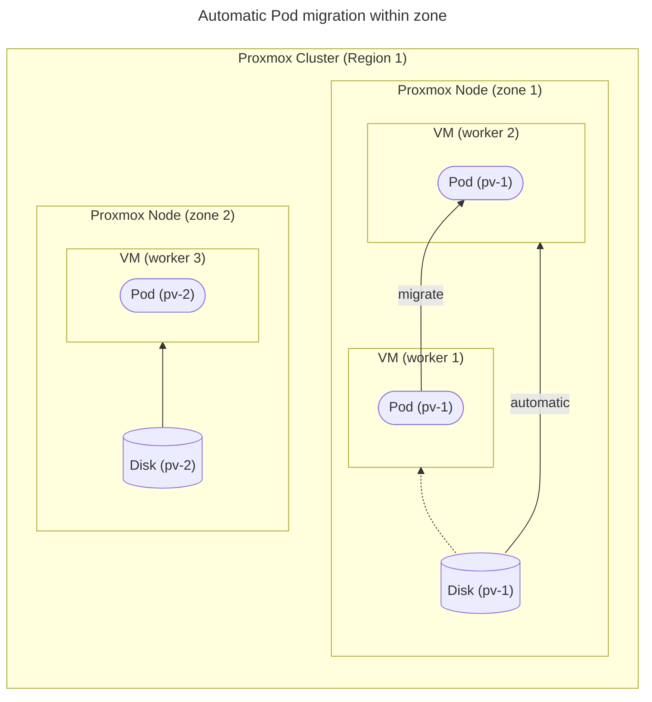
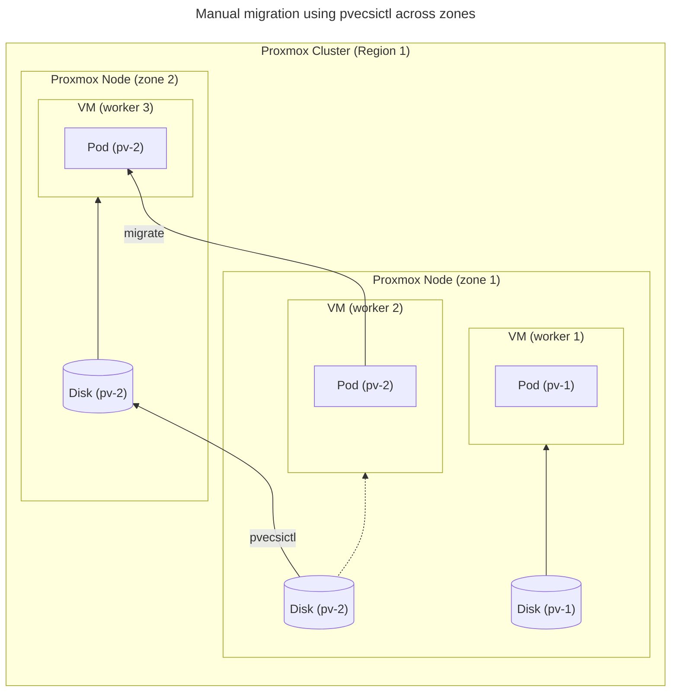

# Architecture

Proxmox cluster with local storage like: lvm, lvm-thin, zfs, xfs, ext4, etc.

- Each Proxmox cluster has predefined in cloud-config the region name (see `clusters[].region` below).
- Each Proxmox Cluster has many Proxmox Nodes. In kubernetes scope it is called as `zone`. The name of `zone` is the name of Proxmox node.
- Pods can easily migrate between Kubernetes nodes on the same physical Proxmox node (`zone`).
  The PV will automatically be moved by the CSI Plugin.
- Pods with PVC `cannot` automatically migrate across zones (Proxmox nodes).
  You can manually move PVs across zones using [pvecsictl](docs/pvecsictl.md) to migrate Pods across zones.

